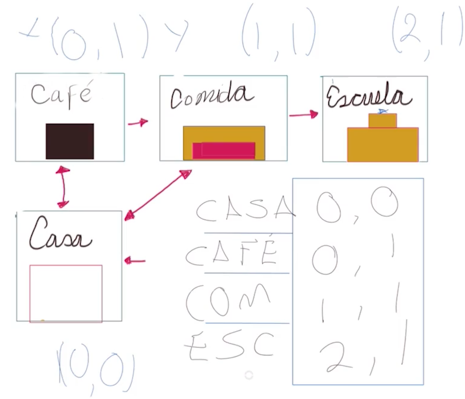
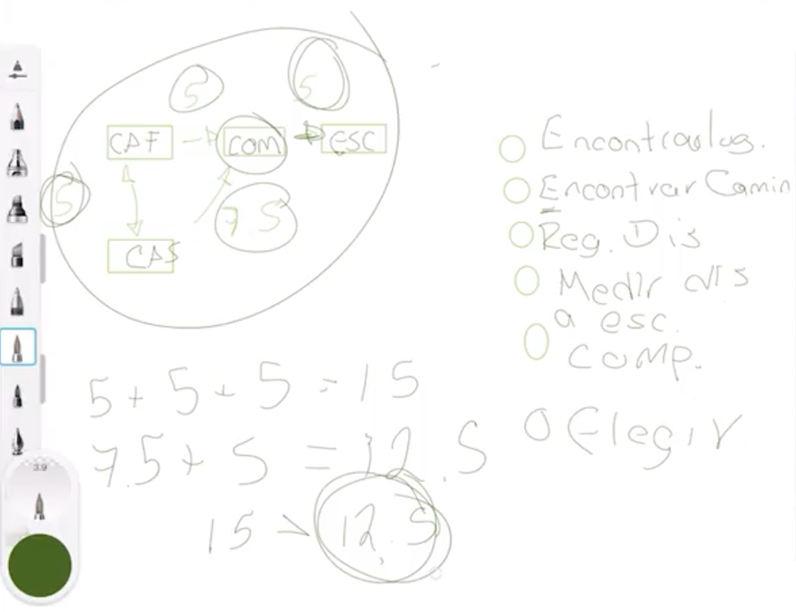

# 4. Estrucuturas de datos

Arrays
Listas, listas enlazadas, arboles, grafos

Se dividen en dos grandes familias, lineales y las no lineales (arboles y grafos)

Adyacencias (es un dato que la computadora va a detectar al lado del otro), vecinos.

Las estructuras de datos son una forma eficiente de almacenar y organizar la información de nuestro programa. Existen diferentes estructuras que vamos a estudiar durante el curso, es muy importante trabajar con una buena estructura que nos ayude a resolver nuestros problemas de la mejor manera posible.

Podemos clasificar las estructuras en dos grandes grupos:

Lineales: La información se guarda de forma secuencial y podemos personalizar el orden en que se guardan. Por ejemplo, de acuerdo a las fecha, relevancia de la información, entre otras.
No lineales: No toda la información está al mismo nivel o almacenada con un orden especifico. Por ejemplo, en la estructura de árbol tenemos un tronco principal con diferentes ramificaciones que surgen a partir de este o, también, la estructura de grafos donde tenemos puntos de información dispersos pero interconectados entre sí.

# 5. ¿Que es una algoritmo?

Un algoritmo es un conjunto de instrucciones o pasos que resuelven un problema dado paso a paso y sin generar ambigüedades.

Las instrucciones de la computadora siempre deben dar los mismos resultados cuando tienen los mismos datos de entrada. Por ejemplo, no importa cuantas veces lo preguntes, la operación 5+5 siempre es igual a 10.

Además, podemos programar diferentes instrucciones que terminan con el mismo resultado. Nuestro trabajo también es descubrir cuál es la mejor manera de solucionar estos problemas.

Vamos a crear un diagrama de flujo para realizar un algoritmo que debe resolver el problema de cómo encontrar la ruta más corta para ir de un lugar a otro.

Los pasos recomendados para desarrollar un algoritmo son los siguientes:

Definición del problema
Análisis del problema
Diseño del algoritmo
Verificación o pruebas
Para la definición del problema debemos obtener los siguientes elementos:

Entradas: ¿Qué se necesita para realizar los pasos?
Salidas: ¿Qué se obtiene al final del algoritmo?
Tipos de datos involucrados: Textos, números, listas, etc.

# 7. Variables y tipos de datos

Esta lectura es un pequeño recordatorio de un par de conceptos que conoces desde hace mucho, primero hablemos de las variables.

Variables
Todos hemos resuelto ecuaciones matemáticas simples alguna vez en nuestra vida, como la que te comparto a continuación ecuacionEjemplo.PNG

Y no te debes enfocar en entender qué problema resuelve esta ecuación, sólo necesitas recordar las letras que utilizabas para denotar variables que aún no conocías, estas se conocen como variables y nos servían para almacenar valores (datos) y en ciencias de la computación también necesitamos almacenar datos y esto se hace a través de las variables.

Tipos de datos

¿Recuerdas cuando tu profesor de física te preguntaba si eran manzanas o perros o qué?
Sí, cuando encontrabas por ejemplo la solución a un problema de velocidad y se te olvidaba decir que eran 5 kilómetros por hora o metros por segundo, bueno era importante especificar la magnitud a la que hacía referencia el valor 5, en computación de igual forma necesitamos indicar si el dato almacenado en nuestra variable va a ser numérico decimal, hexadecimal, flotante, texto, caracteres, etc. para que el sistema sea capaz de interpretarlo correctamente y los resultados en todas nuestras operaciones tengan coherencia.

Para ayudar a los usuarios los compiladores (que siguen un estándar dado para cada lenguaje) tienen una serie de datos predefinidos por ejemplo:

Un entero guarda 2 bytes (puede variar en algunos compiladores), un valor flotante utiliza 4 bytes, etc. Esto quiere decir que en memoria estamos reservando 2 bytes (16 bits) y diciendo que utilizaremos valores de tipo entero. Igualmente, combinando 4 bytes (32 bits) obtenemos un Float o tipo de datos flotante. Los tipos de datos nos ayudan a escribir código más eficientemente. En general te puedes encontrar con 2 tipos de datos:

•​System-defined data types (tipos de datos definidos por el sistema también conocidos como Primitivos)
•​User-defined data types (Tipos de datos definidos por el usuario).

# 8. User defined data Types

Los User Defined DataTypes son tipos de datos creados por los desarrolladores de software para realizar múltiples acciones.

Estos datos pueden estar compuestos por otro tipo de datos previamente definidos pero, por defecto, no son parte del sistema. Además, dependiendo del lenguaje de programación que manejes, deberás tener claro (o no) el consumo de memoria.

Por ejemplo, las aplicación de cobranzas necesitan un tipo de dato personalizado para las personas con deudas.