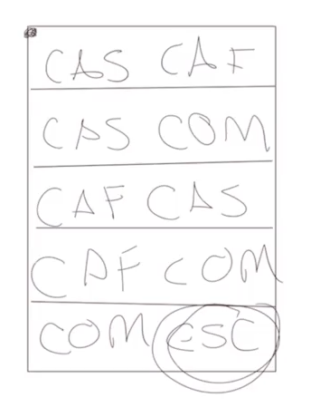

# 4. Estrucuturas de datos

Arrays
Listas, listas enlazadas, arboles, grafos

Se dividen en dos grandes familias, lineales y las no lineales (arboles y grafos)


Adyacencias (es un dato que la computadora va a detectar al lado del otro), vecinos.



Las estructuras de datos son una forma eficiente de almacenar y organizar la información de nuestro programa. Existen diferentes estructuras que vamos a estudiar durante el curso, es muy importante trabajar con una buena estructura que nos ayude a resolver nuestros problemas de la mejor manera posible.

Podemos clasificar las estructuras en dos grandes grupos:

Lineales: La información se guarda de forma secuencial y podemos personalizar el orden en que se guardan. Por ejemplo, de acuerdo a las fecha, relevancia de la información, entre otras.
No lineales: No toda la información está al mismo nivel o almacenada con un orden especifico. Por ejemplo, en la estructura de árbol tenemos un tronco principal con diferentes ramificaciones que surgen a partir de este o, también, la estructura de grafos donde tenemos puntos de información dispersos pero interconectados entre sí.

# 5. ¿Que es una algoritmo?

Un algoritmo es un conjunto de instrucciones o pasos que resuelven un problema dado paso a paso y sin generar ambigüedades.

Las instrucciones de la computadora siempre deben dar los mismos resultados cuando tienen los mismos datos de entrada. Por ejemplo, no importa cuantas veces lo preguntes, la operación 5+5 siempre es igual a 10.

Además, podemos programar diferentes instrucciones que terminan con el mismo resultado. Nuestro trabajo también es descubrir cuál es la mejor manera de solucionar estos problemas.

Vamos a crear un diagrama de flujo para realizar un algoritmo que debe resolver el problema de cómo encontrar la ruta más corta para ir de un lugar a otro.


Los pasos recomendados para desarrollar un algoritmo son los siguientes:

Definición del problema
Análisis del problema
Diseño del algoritmo
Verificación o pruebas
Para la definición del problema debemos obtener los siguientes elementos:

Entradas: ¿Qué se necesita para realizar los pasos?
Salidas: ¿Qué se obtiene al final del algoritmo?
Tipos de datos involucrados: Textos, números, listas, etc.

# 7. Variables y tipos de datos

Esta lectura es un pequeño recordatorio de un par de conceptos que conoces desde hace mucho, primero hablemos de las variables.

Variables
Todos hemos resuelto ecuaciones matemáticas simples alguna vez en nuestra vida, como la que te comparto a continuación ecuacionEjemplo.PNG

Y no te debes enfocar en entender qué problema resuelve esta ecuación, sólo necesitas recordar las letras que utilizabas para denotar variables que aún no conocías, estas se conocen como variables y nos servían para almacenar valores (datos) y en ciencias de la computación también necesitamos almacenar datos y esto se hace a través de las variables.

Tipos de datos

¿Recuerdas cuando tu profesor de física te preguntaba si eran manzanas o perros o qué?
Sí, cuando encontrabas por ejemplo la solución a un problema de velocidad y se te olvidaba decir que eran 5 kilómetros por hora o metros por segundo, bueno era importante especificar la magnitud a la que hacía referencia el valor 5, en computación de igual forma necesitamos indicar si el dato almacenado en nuestra variable va a ser numérico decimal, hexadecimal, flotante, texto, caracteres, etc. para que el sistema sea capaz de interpretarlo correctamente y los resultados en todas nuestras operaciones tengan coherencia.

Para ayudar a los usuarios los compiladores (que siguen un estándar dado para cada lenguaje) tienen una serie de datos predefinidos por ejemplo:

Un entero guarda 2 bytes (puede variar en algunos compiladores), un valor flotante utiliza 4 bytes, etc. Esto quiere decir que en memoria estamos reservando 2 bytes (16 bits) y diciendo que utilizaremos valores de tipo entero. Igualmente, combinando 4 bytes (32 bits) obtenemos un Float o tipo de datos flotante. Los tipos de datos nos ayudan a escribir código más eficientemente. En general te puedes encontrar con 2 tipos de datos:

•​System-defined data types (tipos de datos definidos por el sistema también conocidos como Primitivos)
•​User-defined data types (Tipos de datos definidos por el usuario).

# 8. User defined data Types

Los User Defined DataTypes son tipos de datos creados por los desarrolladores de software para realizar múltiples acciones.

Estos datos pueden estar compuestos por otro tipo de datos previamente definidos pero, por defecto, no son parte del sistema. Además, dependiendo del lenguaje de programación que manejes, deberás tener claro (o no) el consumo de memoria.

Por ejemplo, las aplicación de cobranzas necesitan un tipo de dato personalizado para las personas con deudas.

# 11. Abstract Data Types básicos: Lists, Stacks, Queues

Un tipo de dato abstracto (ADT) representa un set particular de comportamientos, aunque no define su implementación.
Mientras que una estructura de datos es más concreta. Típicamente es la implementación de un ADT.
Los ADT más básicos serían: Lists, Stacks, Queues, Diccionarios, Arrays, Linked Lists, Trees.

# 12. Explicacion gráfica Data Types

Como vimos en la clase anterior existen diversos Abstract Data Types típicos y los más básicos son los siguientes:

- **List**, Conjunto de valores ordenados secuencialmente donde son recuperados mediante un número del 0 al n.

Para las listas algunos metodo son, ***get*** que retorna el elemento de la posicion dada.

- **Stack** (LIFO, Last in First Out): En estos datos se van agregando elementos con la peculiaridad de que el último en agregarse será el primero en recuperarse.

metodos: ***push*** para agregar un eleemnto, ***pop*** para sacar un elemento.

- **Queue** (FIFO, First in First Out): Al contrario del stack, los Queue se caracterizan por que la recuperación de datos siga la misma secuencia de la inserción de los datos, así el primer dato será recuperado al principio, y el último al final.

- **Linked List** Cada elemento se vincula (Apunta) con el siguiente nodo, al no estar definidas de un inicio. las linked lists pueden tener el tamaño que sea.

- **Dictionary** Similar a las listas, pero con un índice numérico o no numérico del tipo de datos que se desee (aunque tiene que ser único)


# 13. Glosario de funciones para Abstract Data Types

En esta lectura de referencia encontrarás la definición de los 3 Abstract Data Types más utilizados: listas ADT, Stack o Pila ADT y Queue o Cola ADT.

La forma general de conocer cada una de estas 3 ADT es a través de sus definiciones y las definiciones sólo mencionan qué operaciones serán implementadas, sin embargo no especifican cómo se organizarán los datos en memoria o cuál algoritmo se utilizará para implementar las operaciones. Estas tres definiciones hacen parte de lo que conocemos como tipos de datos abstractos, porque dan una vista independiente de la implementación.
Debido a esto es importante que conozcas los métodos o funcionalidades que podrás encontrar en un ADT.

List ADT
Una lista es un tipo de datos abstracto utilizado para representar un número contable de valores ordenados. El mismo valor puede existir más de una vez, esta es la implementación computacional del concepto matemático de secuencia finita, la lista.

A continuación te comparto las operaciones disponibles en este ADT:

get() – Retorna un elemento de la lista en cualquier posición especificada.
insert() – Inserta un elemento en cualquier posición de la lista.
remove() – Remueve la primera aparición de cualquier elemento en una lista no-vacía.
removeAt() – Remueve el elemento que se encuentre en la posición especificada en una lista que no esté vacía.
replace() – Reemplaza un elemento en cualquier posición por otro elemento.
size() – Retorna el número de elementos contenidos en la lista.
isEmpty() – Retorna true si la lista está vacía, si no, regresa false.
isFull() – Retorna true si la lista está llena, si no, regresa false.

Stack ADT
Un Stack es un tipo de datos abstracto que sirve como una colección de elementos con dos operaciones principales:
Push: agrega un elemento a la colección
Pop remueve el elemento que se añadió más recientemente y que no ha sido removido, el orden en el que esto funciona como hemos visto en clases sigue la lógica LIFO (last in, first out) que en español sería “último o más reciente en entrar, primero en salir”

A continuación te comparto las operaciones disponibles en este ADT:

push() – Inserta un elemento en un extremo de la pila denominado “cima”.
pop() – Remueve y retorna el elemento en la cima de la pila, si el stack no está vació.
peek() – Retorna el elemento en la cima del stack sin removerlo, si el stack no está vacío.
size() – Retorna el número de elementos en el stack.
isEmpty() – Retorna true si el stack está vacío, si no, retorna false.
isFull() – Retorna true si la lista está llena, si no, regresa false.

Queue ADT
Una cola es un ADT que sirve para almacenar datos en el orden en el que los datos van llegando, sigue una lógica del tipo FIFO o “primero en llegar, primero en salir” como es en la mayoría de supermercados.

A continuación te comparto las operaciones disponibles en este ADT:

enqueue() – Inserta un nuevo elemento al final de la cola.
dequeue() – Remueve y retorna el primer elemento de la cola si la cola no está vacía.
peek() – Retorna el primer elemento de la cola sin removerlo.
size() – Retorna el número de elementos almacenados en la cola.
isEmpty() – Retorna true si la cola está vacía, si no, retorna false.
isFull() – Retorna true si la cola está vacía, si no, retorna false.

# 14. Clases y objetos

La abstraccion es una clase y se compone de atributos y metodos.

# 20. Algoritmos de ordenamiento

Un algoritmo de ordenamiento es simple y sencillamente un algoritmo que se encargará de colocar en orden una secuencia dada convirtiendo un arreglo desordenado en un arreglo ordenado (Un arreglo que tiene un orden específicamente definido).
Existen múltiples algoritmos de ordenamiento, y algunos de los más usados son:
**Merge Sort**
Utiliza el paradigma divide y vencerás, Dividiendo los elementos para compararlos y posteriormente volverlos a unir ordenados de la manera correcta.
Es un algoritmo eficiente para muchos datos, pero no lo es tanto para pocos
**Insertion Sort**
Vas comparando los elementos hasta que encuentren su lugar en la serie de 1 a 1.
Es un algoritmo eficiente para serie de datos cortas, pero no para largas.
**Bubble Sort**
Se ordena por pares y se va repitiendo 1 a 1 hasta que queda totalmente ordenado, es muy iterativo, poco eficiente (por la cantidad de iteraciones), pero muy sencillo de ejecutar.
**Quick Sort**
Utiliza el paradigma divide and conquer, y va comparando desde las esquinas al centro, es muy eficiente para serie de datos largos por lo que es de los más importantes.

**S** Secuencia de objetos ordenables
**N** no. de elementos en S.

# 26. Recursividad

La recursividad es la capacidad de una función de llamarse a si misma.

Las funciones recursivas tienen las siguientes caracteristicas.

-Se llaman a si mismas.
-Tienen de argumento un valor que cambio por cada iteración.
-Regresan algún valor definido en cada iteración.
-Tienen una condicional que define el fin del ciclo.
-Manejan un stack que es el órden de las ejecuciones de las iteraciones de la función, empezando por la última a llamar.


# 36. Qué son los Greedy Algorithm

Algoritmo Voraz

Los Greedy Algorithms son algoritmos que van a buscar la solución más óptima para resolver un problema en cada una de sus etapas; vamos a tener varios subprocesos antes de llegar al resultado final.

Este tipo de algoritmos son muy “codiciosos” porque van a encontrar la mejor solución de cada paso pero, en conjunto, puede que no sean la mejor solución al problema completo.

Estos son algunos ejemplos de problemas que se resolverían con Greedy Algorithms:

- Una máquina que da cambio porque va a dividir el dinero de una manera eficiente y correcta.
- Un juego donde debemos calcular el mejor movimiento y podemos usar algoritmos de inteligencia artificial.
- Una aplicación de mapas porque va a buscar la ruta con el menor consumo o la menor distancia.

# 39. Grafos y sus aplicaciones

Los graphos son mapas de set de nodos que tienen múltiples relaciones entre sí mediante enlaces (edges).

Los graphos no tienen estructura de cascada como los árboles binarios, pero comparten la lógica relacional.

Los graphos son definidos por G=(V,E), donde:

- G = Representación del grapho
- V = Set de nodos (vértices)
- E = Enlaces (edges)
Los graphos son el pilar o los fundamentos que se ocupan en bases de datos modernas como es el caso de la base de datos de:

- Las relaciones de amistad de Facebook
- Las recomendaciones de Amazon
- Los seguidores de Twitter


¿Qué es un algoritmo?

Serie de instrucciones paso a paso para realizar una tarea.

2.
El código que nos permite dibujar un cuadrado recursivo es:

def draw(myTurtle, length):
  if length > 0:
    myTurtle.forward(length)
    myTurtle.left(90)
    draw(myTurtle, length - 10)
3.
¿En cuál bloque de código aplicamos programación dinámica (índices, particiones…)?

if low < high:
  pi = particion(arr, low, high)
  quickSort(arr, low, pi-1)
  quickSort(arr, pi+1, high)
4.
Corresponde a una estructura de datos no lineal:

Árbol

5.
Un algoritmo es un set de instrucciones específicas que van a enseñar los pasos a seguir.

Verdadero

6.
Es un tipo de dato abstracto:

Todas las respuestas son correctas.

7.
¿Recuerdas qué tipo de algoritmo es el método Bubble Sort? ¿Qué función realiza este método en el siguiente ejemplo?

int i, j;

for(i=0; i < n-1; i++)
{
    for(j=0; j < n-i-1; j++)
    {
        // [10, 5, 3, 3333]
        if(vector_entrada[j]>vector_entrada[j+1])
            cambiar_pos(&vector_entrada[j],&vector_entrada[j+1]);
    }
}
Ordenamiento de datos

8.
¿Qué son las estructuras de datos?

Son una manera eficiente de organizar y almacenar información de nuestro programa.

9.
¿Qué es un grafo?

Un set de nodos que tienen múltiples relaciones entre sí.

10.
¿Recuerdas para qué sirve la palabra clave return en cualquier lenguaje de programación? ¿Qué retorna la siguiente función de C++ al ejecutarse?

if (N<0)
    INT_MAX;

    //recorremos todo nuestro set de moneas AKA opciones para dar cambio
    for(int i = 0; i<n; i++)
    {
        int res = greedyChange(coinSet, n, N - coinSet[i]);
        if(res != INT_MAX)
            coins = min(coins, res+1);
    }

} ```
Retorna los ciclos que le tomó obtener el cambio.

11.
¿Cuál es la función del siguiente bloque de código en Python?

for i in range(n):
    print("%d" %arr[i])
Imprimir todos los datos en un arreglo “n”.

12.
¿Cuál de los siguientes algoritmos ordena de menor a mayor el set de números dado?

defquickSort(arr, low, high):
  if low < high:
    pi = particion(arr, low, high)
    quickSort(arr, low, pi-1)
    quickSort(arr, pi+1, high) ```
13.
¿Qué es recursión?

Es una técnica de programación que involucra el uso de una función, proceso o sub-rutina que se llama a sí misma una o más veces hasta que una condición específica se cumple y, entonces, empieza a resolver cada una de las repeticiones, comenzando de la última invocada hasta la primera, resolviendo un problema dado en una serie de pasos finitos.

14.
¿Cuál de las siguientes frases describe al algoritmo MergeSort?

Es un algoritmo del tipo divide and conquer. Dividimos el array de entrada en dos mitades, invocamos la función merge_sort(arr, low, mid); y merge_sort(arr, mid+1, high); en cada una de esas mitades y luego la función merge() se encargará de unir las dos mitades.

15.
¿Qué información o requerimientos necesitas para definir el problema que va a resolver tu algoritmo (antes de empezarlo a programar en cualquier lenguaje)?

Entradas (elementos necesarios para solucionar el problema) y salidas (resultado que obtenemos al final del algoritmo).

REPASAR CLASE
16.
¿Cuál de las siguientes afirmaciones es correcta sobre los User Defined Data Types?

Todas las afirmaciones son correctas.

17.
¿Qué es ordenamiento de datos?

Un algoritmo de ordenamiento que se encarga de colocar una secuencia dada en orden, convirtiendo un arreglo desordenado en un arreglo ordenado.

REPASAR CLASE
18.
Consiste en resolver problemas complejos dividiéndolos en un conjunto de problemas más simples:

Divide and conquer (divide y vencerás)

19.
¿Cuál es la diferencia entre programación dinámica y divide and conquer (divide y vencerás)?

En programación dinámica cada uno de los problemas que solucionamos se guardan automáticamente para poder utilizarlos después y optimizar mucho mejor nuestros algoritmos.

20.
¿Cuál es la unidad mínima de información que podemos manejar en una computadora?

Bit

21.
¿Qué son los números binarios?

Es un sistema de numeración que solo utiliza dos cifras: 0 y 1.